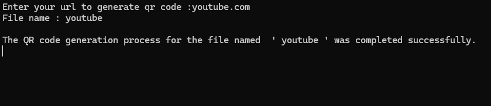

# QRcode-creator
A QR code project written in Python that can generate a QR code from any website URL.

## What is a QR code?
A QR code is a two-dimensional barcode that stores data such as URLs, text, or contact information.
It can be quickly scanned with a smartphone or QR reader to access the encoded content instantly.

## What is a QR code used for?
- [x] Accessing websites or online content quickly
- [x] Sharing contact information (vCard, phone number, email)
- [x] Making digital payments and banking transactions
- [x] Downloading apps or files
- [x] Logging into accounts or services securely
- [x] Tracking products and inventory in logistics
- [x] Marketing campaigns and promotional materials
- [ ] Predicting the future or reading your mind (sadly, still not supported)

### How is qrcode.py used?

1. First, to use the 'pyqrcode' library, we need to download the libary:
   - You need to go to the terminal and write:
   - 

2. You need to open your code editor and copy the contents of the file named "qrcode.py" and save it into the file you created.
     - VS Code
     - PyCharm etc.

3. You should import the "pyqrcode" library within your code file: 'import pyqrcode'
   - 

4. Copy all the code from the file named "qrcode.py" and paste it into your own file.

5. Finally, run your code in the terminal. Example:
   - 
> [!NOTE]
> The QR code is saved by default in the ".svg" (Scalable Vector Graphics) format, not as ".png". You can change it if you wish.

I hope the code I wrote is useful to you. Best regards.
_by Emin_
